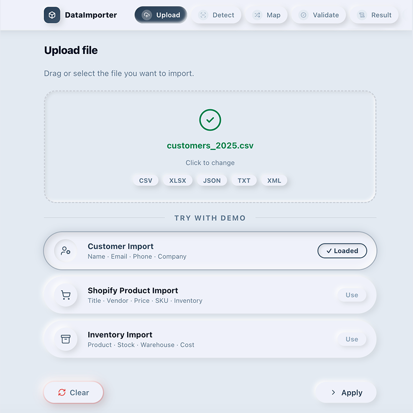

# DataImporter


Frontend import workflow template with real local parsers.

Import CSV, XLSX, JSON, XML or TXT files, detect fields, map data, validate results and hand off the final mapped payload to your own app.

Quick setup: see [`INSTALL.md`](INSTALL.md).

<p>
  <a href="#live-demo">
    
  </a>
  <a href="https://xunevega.gumroad.com/l/dataimporter-react">
    
  </a>
</p>

## Hero Preview



> DataImporter is focused on structured frontend data workflows. It does not include PDF parsing, OCR, database connections, backend services or external API integrations.

---

## Landing + Live Demo

The project includes a sales landing page as the first screen. The landing presents the product scope, supported formats, included templates and final CTA.

The **Live Demo** button opens the actual 5-step import workflow inside the same React app.

---

## Product Scope

DataImporter is sold as a functional frontend import workflow, not as a complete SaaS application.

It includes real local parsers for CSV, XLSX, JSON, TXT and XML. Every parser converts uploaded data into a common structure:

```js
{
  fields: [],
  rows: []
}
```

After validation, the workflow stops at `onComplete(mappedPayload)` or a downloadable import report. From there, you decide whether to send the mapped payload to your own backend, store it in app state or connect it to an API.

It does not include backend persistence, database connections, OCR, PDF parsing, AI processing or external Shopify/database integrations.

---

## Getting Started

Install dependencies:

```bash
npm install
```

Run the development server:

```bash
npm run dev
```

Build for production:

```bash
npm run build
```

Preview the production build:

```bash
npm run preview
```

---

## Workflow Overview

DataImporter guides users through a complete import workflow:

```text
CSV
  ↓
Detect
  ↓
Map
  ↓
Validate
  ↓
Import
```

| Step | What happens |
| --- | --- |
| CSV | Select a structured file or start from demo data. |
| Detect | Analyze fields, labels and sample values. |
| Map | Connect source fields to your destination schema. |
| Validate | Check coverage, missing fields, errors and warnings. |
| Import | Prepare the mapped payload and generate a downloadable summary. |

## Features

| Feature | Description |
| --- | --- |
| React | Built as a modern React workflow template. |
| Vite | Fast local development and production builds. |
| Tailwind-compatible | Easy to adapt to Tailwind projects and utility-first systems. |
| Responsive | Designed for compact app screens and responsive layouts. |
| Demo Data | Includes customer, product and inventory import examples. |
| Import Report Screen | Shows mapped fields, skipped fields and a report summary. |
| Validation Engine | Checks coverage, missing destinations and warnings. |
| Mapping Engine | Maps source fields to your destination schema before handoff. |

## Supported Formats

| Format | Supported |
| --- | --- |
| CSV | ✓ |
| Excel XLSX | ✓ |
| JSON | ✓ |
| XML | ✓ |
| TXT | ✓ |

## Demo Templates Included

| Template | Fields |
| --- | --- |
| Customer Import | Name, Email, Phone, Company |
| Shopify Product Import | Title, Vendor, Price, SKU, Inventory |
| Inventory Import | Product, Stock, Warehouse, Cost |

Demo templates are stored separately in:

```text
src/data/demoTemplates.js
```

To remove the example buttons from the workflow, set the exported array to empty:

```js
export const DEMOS = [];
```

When `DEMOS` is empty, the demo template cards and the workflow example buttons are hidden automatically. Real file uploads still work through the parsers in `src/parsers/`.

## Technical Overview

| Feature | Included |
| --- | --- |
| React | ✓ |
| Vite | ✓ |
| Tailwind-compatible | ✓ |
| Local parsing | ✓ |
| Demo data | ✓ |
| Responsive | ✓ |
| Documentation | ✓ |
| Backend included | No |
| External integrations | No |

## Folder Structure

```text
src/
├── App.jsx
├── data/
│   ├── demoTemplates.js
│   └── destinationSchema.js
├── main.jsx
├── index.css
└── parsers/
    ├── parseCsv.js
    ├── parseXlsx.js
    ├── parseJson.js
    ├── parseXml.js
    └── parseTxt.js
```

## Use Cases

| Use case | Description |
| --- | --- |
| CRM Imports | Import contacts, leads, companies and account data. |
| ERP Imports | Bring structured operational data into business systems. |
| Shopify Imports | Prepare product fields like title, vendor, price, SKU and inventory for your own Shopify integration. |
| Inventory Synchronization | Map product, stock, warehouse and cost fields into internal tools. |

## Why This Template Saves Weeks Of Development

- Import screens ready
- Mapping UI included
- Validation flow included
- Ready to customize


## Live Demo

The landing page includes a **Live Demo** button. It opens the real 5-step workflow inside the React app:

```text
Upload -> Detect -> Map -> Validate -> Result
```

## Screenshots

The package includes screenshots for the full workflow. Use these assets in the README, Gumroad, LemonSqueezy or marketplace galleries.

Put screenshots in:

```text
screenshots/
```

Current screenshot files:

| Step | Screenshot |
| --- | --- |
| Hero | `screenshots/hero.png` |
| Upload | `screenshots/upload.png` |
| Detect | `screenshots/detect.png` |
| Map | `screenshots/map.png` |
| Validate | `screenshots/validate.png` |
| Result | `screenshots/result.png` |

## What's Included

| Included | |
| --- | --- |
| • Complete source code | • Documentation |
| • React + Vite project | • Responsive design |
| • 5-step workflow | • Commercial use |
| • Real local parsers | •Ready to customize |
| • Demo datasets |  |
| |  |

## Usage

Use DataImporter as the frontend workflow. It parses local files, builds the mapped payload and lets your app decide what happens next.

```js
import { DataImporter } from "./template/DataImporter";

const customerSchema = [
  { key: "fullName", label: "Full Name", required: true },
  { key: "email", label: "Email", required: true },
  { key: "phone", label: "Phone" },
  { key: "company", label: "Company" }
];

export function CustomerImportPage() {
  return (
    <DataImporter
      destinationSchema={customerSchema}
      onComplete={(mappedPayload) => {
        console.log(mappedPayload);
        // Send it to your backend, update app state or download a report.
      }}
    />
  );
}
```

## Parser Architecture

DataImporter is built around a parser-friendly architecture. The included local parsers normalize supported files before the detection and mapping steps.

Real parser files are included in `src/parsers/`:

```text
src/parsers/
├── parseCsv.js
├── parseXlsx.js
├── parseJson.js
├── parseXml.js
└── parseTxt.js
```

Parser output shape:

```js
{
  fields: ["name", "email", "phone", "company"],
  rows: [
    {
      name: "Alice Johnson",
      email: "alice@example.com",
      phone: "612000001",
      company: "Acme Corp"
    }
  ]
}
```

Typical destination schema:

```js
[
  { key: "fullName", label: "Full Name", required: true },
  { key: "email", label: "Email", required: true },
  { key: "phone", label: "Phone", required: false },
  { key: "company", label: "Company", required: false }
]
```

## Customization

Most UI customization happens in `src/App.jsx`. Demo data, parser logic and destination fields are separated into their own files.

| Area | Where to customize |
| --- | --- |
| Colors and theme | `T` token object |
| Demo templates | `src/data/demoTemplates.js` |
| Destination fields | `src/data/destinationSchema.js` |
| File parsers | `src/parsers/parseCsv.js`, `parseXlsx.js`, `parseJson.js`, `parseXml.js`, `parseTxt.js` |
| Completion behavior | Connect the final mapped payload to your own app state, backend or API |
| Screenshots | Replace files inside `screenshots/` |

## FAQ

| Question | Answer |
| --- | --- |
| Does it connect to databases? | No. DataImporter is a frontend workflow template. |
| Does it include backend? | No. Connect the final mapped payload to your own backend or app state. |
| Can I customize mappings? | Yes. The mapping step is designed to work with your destination schema. |
| Can I add parsers? | Yes. Add parsers for CSV, XLSX, JSON, XML, TXT or API-provided records. |
| Does it import into Shopify? | No. It prepares mapped product data that your own Shopify integration can consume. |

## Pricing / Final CTA

**DataImporter**  
React Import Workflow Template

**$49**

[Download Now](https://xunevega.gumroad.com/l/dataimporter-react)

## What This Is Not

DataImporter intentionally does not include:

- PDF extraction
- OCR
- Document AI
- External vision APIs
- Database connection
- Backend implementation

This keeps the template lightweight, fast and easy to integrate into existing React applications.

## License

Use this template according to [`LICENSE.txt`](LICENSE.txt).
