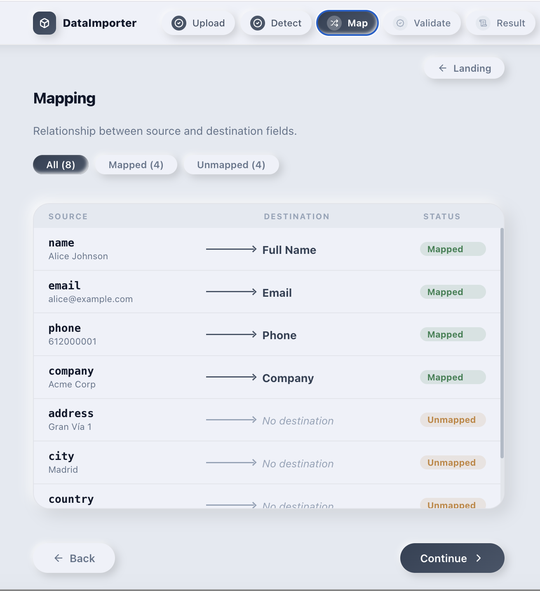

# DataImporter

React + Vite import workflow template for CSV, XLSX, JSON, XML and TXT.

Build a complete frontend import flow with upload, field detection, mapping, validation and CSV export.

## Live Demo

https://xunevega-dataimporter.vercel.app

## Buy

https://xunevega.gumroad.com/l/dataimporter-react

## What It Includes

- React + Vite frontend workflow
- CSV, XLSX, JSON, XML and TXT local parsers
- Upload, detect, map, validate and result screens
- Demo import templates
- CSV export from mapped data
- Responsive UI
- Documentation included in the paid package

## What It Does Not Include

- Backend
- Database connection
- External API integration
- PDF parsing
- OCR
- AI processing

## Screenshots

## License

This public repository is a product preview only.

The full source code is available through Gumroad.
